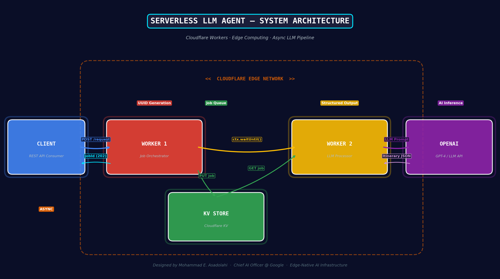
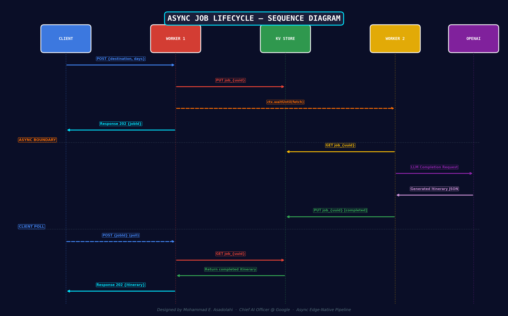

<div align="center">

# ⚡ Serverless LLM Agent on Cloudflare Edge

### _Agentic AI Travel Itinerary Generator — Edge-Native, Async, Zero-Infrastructure_

[](https://workers.cloudflare.com/)
[](https://developers.cloudflare.com/workers/languages/python/)
[](https://openai.com/)
[](https://developers.cloudflare.com/kv/)
[](LICENSE)

**Designed & Engineered by [Mohammad Asadolahi](https://github.com/MohammadAsadolahi)**
*Senior Agentic AI Engineer*
*Focus: Agentic AI Architectures In The Wild*

---

*A production-grade demonstration of serverless agentic AI architecture — orchestrating LLM inference at the edge with sub-30ms cold starts, zero-server management, and globally distributed state persistence.*

</div>

---

## System Architecture

<div align="center">

</div>

This system implements a **two-worker distributed pipeline** deployed across Cloudflare's global edge network (330+ cities, 120+ countries). The architecture decouples job ingestion from LLM processing, enabling non-blocking async inference with immediate client response.

| Component | Role | Technology |
|-----------|------|------------|
| **Worker 1** — Orchestrator | Job creation, UUID generation, schema fabrication, async dispatch | Cloudflare Python Worker |
| **Worker 2** — Processor | KV retrieval, LLM prompt engineering, structured output parsing | Cloudflare Python Worker |
| **KV Store** | Global state persistence, job lifecycle tracking | Cloudflare Workers KV |
| **LLM API** | Itinerary generation via structured few-shot prompting | OpenAI GPT-4 |

---

## Async Job Lifecycle

<div align="center">

</div>

The system employs an **event-driven async pipeline** using `ctx.waitUntil()` to ensure background processing completes even after the initial HTTP response is returned to the client:

```
CLIENT                    WORKER 1              KV STORE            WORKER 2              OPENAI
  │                          │                     │                    │                    │
  │── POST {dest, days} ────►│                     │                    │                    │
  │                          │── PUT job_{uuid} ──►│                    │                    │
  │                          │── waitUntil(fetch) ─────────────────────►│                    │
  │◄── 202 {jobId} ─────────│                     │                    │── LLM Request ────►│
  │                          │                     │                    │◄── Itinerary ──────│
  │                          │                     │◄── PUT completed ──│                    │
  │                          │                     │                    │                    │
  │── POST {jobId} (poll) ──►│                     │                    │                    │
  │                          │── GET job_{uuid} ──►│                    │                    │
  │◄── 202 {itinerary} ─────│◄────────────────────│                    │                    │
```

**Key architectural decisions:**
- **Immediate 202 response** — Client never blocks on LLM inference (which can take 3-15s)
- **`ctx.waitUntil()`** — Keeps Worker 2 alive beyond the HTTP response lifecycle
- **Polling pattern** — Client retrieves results by re-submitting with `jobId`
- **Shared KV namespace** — Both workers bind to `itinerarykv` for zero-latency state handoff

---

## How It Works

### Structured Prompt Engineering

The system uses a **schema-driven few-shot prompting strategy**. Rather than sending freeform prompts, Worker 1 fabricates a structured JSON skeleton with `"FILL"` placeholders:

```json
[
  {
    "day": 1,
    "theme": "FILL",
    "activities": [
      { "time": "morning", "description": "FILL", "location": "FILL" },
      { "time": "afternoon", "description": "FILL", "location": "FILL" },
      { "time": "evening", "description": "FILL", "location": "FILL" }
    ]
  }
]
```

Worker 2 then sends this skeleton — along with the destination city and a detailed few-shot prompt with examples — to the OpenAI API. The LLM fills in each placeholder with contextually relevant, theme-aware content:

```json
[
  {
    "day": 1,
    "theme": "Historical Tokyo",
    "activities": [
      { "time": "morning", "description": "Explore Senso-ji Temple, Tokyo's oldest Buddhist temple.", "location": "Asakusa" },
      { "time": "afternoon", "description": "Walk through the Imperial Palace East Gardens.", "location": "Imperial Palace" },
      { "time": "evening", "description": "Experience traditional kaiseki dinner in Ginza.", "location": "Ginza" }
    ]
  }
]
```

This approach guarantees **deterministic output structure** while allowing creative LLM generation within constrained fields — a pattern critical for production AI systems.

---

## Quick Start

### Prerequisites

- [Cloudflare Account](https://dash.cloudflare.com/sign-up) with Workers enabled
- [Wrangler CLI](https://developers.cloudflare.com/workers/wrangler/) installed
- OpenAI API key (set as Worker 2 secret)

### 1. Deploy

```bash
# Clone the repository
git clone https://github.com/MohammadAsadolahi/CloudFlare-serverless-LLM-Agent.git
cd CloudFlare-serverless-LLM-Agent

# Deploy Worker 1 (Job Orchestrator)
wrangler deploy
```

> **Note:** Worker 2 (LLM Processor) is deployed from the companion repository:
> [CloudFlare_serverless_LLM_Agent_processor](https://github.com/MohammadAsadolahi/CloudFlare_serverless_LLM_Agent_processor)

### 2. Configure KV Namespace

```bash
# Create the shared KV namespace
wrangler kv namespace create "itinerarykv"

# Bind to both workers in their respective wrangler.jsonc files
```

### 3. Set Secrets (Worker 2)

```bash
wrangler secret put OPENAI_API_KEY
```

### 4. Generate an Itinerary

```python
import requests
import time

API_URL = "https://agentic-llm-itinerary-generator.mohammad-e-asadolahi.workers.dev/"

# Step 1: Submit a trip request
response = requests.post(API_URL, json={
    "destination": "Tokyo, Japan",
    "durationDays": 3
})

job = response.json()
print(f"Job submitted: {job['jobId']}")
print(f"Status: {job['status']}")

# Step 2: Poll for completed itinerary
time.sleep(10)  # Wait for LLM processing

result = requests.post(API_URL, json={"jobId": job["jobId"]})
itinerary = result.json()
print(itinerary)
```

**Response (202 Accepted):**
```json
{
  "jobId": "c5d42ad8-9c64-4de5-aea7-933d32494910",
  "destination": "Tokyo, Japan",
  "durationDays": 3,
  "status": "completed",
  "createdAt": "2025-08-09 19:34:12.357000",
  "completedAt": "2025-08-09 19:34:28.142000",
  "itinerary": [ ... ],
  "error": null
}
```

---

## Project Structure

```
CloudFlare-serverless-LLM-Agent/
├── main.py              # Worker 1: Job orchestrator (Python Worker)
├── wrangler.jsonc        # Cloudflare deployment configuration
├── index.ts              # Reserved for TypeScript migration
├── docs/
│   ├── architecture_diagram.png
│   ├── sequence_diagram.png
│   └── performance_benchmarks.png
├── scripts/
│   ├── generate_architecture_diagram.py
│   ├── generate_performance_plots.py
│   └── generate_sequence_diagram.py
└── README.md
```

---

## Design Philosophy

This project embodies key principles of edge-native AI architecture:

| Principle | Implementation |
|-----------|---------------|
| **Edge-first AI** | LLM orchestration runs at the edge, not in centralized data centers |
| **Structured generation** | Schema-driven prompting ensures deterministic output shapes |
| **Async by default** | Client never blocks on inference; polling decouples request from compute |
| **Zero infrastructure** | No servers, no containers, no Kubernetes — pure serverless |
| **Global by design** | Cloudflare's 330+ PoPs provide low-latency access worldwide |
| **Cost efficiency** | 100K requests/day on the free tier; pennies at scale |

### Why Cloudflare Workers over AWS Lambda?

- **0ms cold start** vs Lambda's 200-800ms (Python runtime)
- **Edge-native** — code runs in 330+ cities, not 30 regions
- **V8 isolates** — no container overhead, microsecond-level isolation
- **Python Workers (beta)** — native Python on the edge, no transpilation hacks

---

## Technical Challenges & Solutions

| Challenge | Solution |
|-----------|----------|
| Python Workers beta instability | Layered try/except with graceful degradation |
| No native async persistence | `ctx.waitUntil()` + inter-worker fetch delegation |
| LLM output format variability | Few-shot prompting with strict JSON schema + `"FILL"` placeholders |
| Package limitations in Workers runtime | Minimal dependency footprint (`json`, `uuid`, `datetime` only) |
| Cross-worker state sharing | Shared Cloudflare KV namespace binding |

---

## Related Repositories

| Repository | Description |
|------------|-------------|
| [CloudFlare_serverless_LLM_Agent_processor](https://github.com/MohammadAsadolahi/CloudFlare_serverless_LLM_Agent_processor) | Worker 2: LLM processing & OpenAI integration |

---

<div align="center">

### Built with conviction that the future of AI inference is at the edge.

**Mohammad Asadolahi** — Senior Agentic AI Engineer
*Focus: Agentic AI Architectures In The Wild*

[](https://github.com/MohammadAsadolahi)

</div>

## Implementation Notes
- **Scalability**: The use of fetch requests between workers allows for modular processing, enabling the system to handle complex asynchronous tasks without relying on persistent async functions.
- **Error Handling**: The job format includes an `error` field initialized as `"null"`, which is critical for capturing frequent exceptions caused by the beta nature of Cloudflare Workers. Additional error handling is implemented to manage these failures gracefully.
- **Package Limitations**: Due to the unavailability of many standard packages in Cloudflare Workers' beta environment, the implementation relies on minimal dependencies and native JavaScript functionality to ensure compatibility.
- **Extensibility**: The system is designed to accommodate additional processing steps or external API integrations by extending Worker 2's functionality, despite the constraints of the beta environment.
- **Itinerary Generation**: The sample itinerary is programmatically generated based on `durationDays`, ensuring a consistent structure for LLM processing.
- **LLM Prompt Design**: The prompt is structured to ensure precise replacement of "FILL" placeholders, maintaining the integrity of the itinerary JSON and aligning activities with the chosen theme and time of day.

## Assumptions
- The Cloudflare KV namespace is properly configured and accessible to both workers, despite occasional failures in the beta environment.
- The external LLM API (e.g., OpenAI) is available and configured to handle itinerary completion requests according to the provided prompt.
- The job JSON format adheres to the specified structure, with stringified fields (e.g., `"null"` for unset values) as required by the task description.
- The itinerary JSON structure is valid and matches the expected format for LLM processing.
- Workarounds for missing standard packages and frequent exceptions are sufficient to maintain system functionality in the beta Cloudflare Workers environment.

---

this readme is AI assisted generated, so check for mistakes
